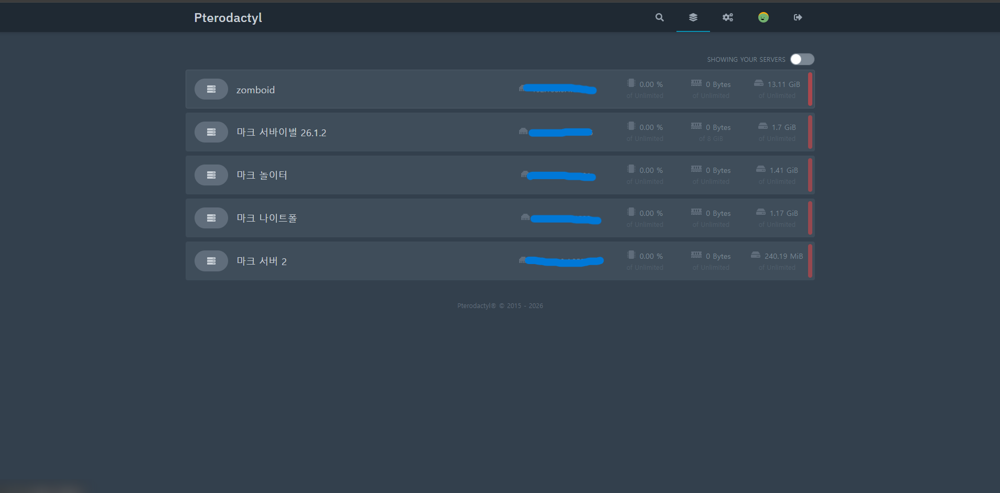

# G.study

### 공부, 프로젝트, 실험과 문제 해결 과정을 모아두는 통합 저장소

배운 내용을 기록하는 데서 끝내지 않고, 직접 적용하고 검증한 결과를 정리합니다.

---

## 저장소 소개

`G.study`는 하나의 기술이나 분야만 다루는 저장소가 아닙니다.

학교 수업과 개인 공부, 개발 프로젝트, 서버 구축, 게임 개발, AI 실험 등 앞으로 진행하는 여러 활동을 한곳에서 관리하고, 완성도가 높아진 작업은 포트폴리오 문서로 발전시키기 위한 공간입니다.

이 저장소에는 다음과 같은 기록이 함께 쌓입니다.

- **Portfolio** — 다른 사람에게 보여줄 수 있도록 정리한 프로젝트
- **Projects** — 현재 개발 중이거나 기능을 확장하고 있는 작업
- **Study** — 프로그래밍 언어, 운영체제, 네트워크 등 학습 기록
- **Experiments** — 새로운 기술을 직접 설치하고 테스트한 기록
- **Troubleshooting** — 문제의 원인, 시도한 방법, 해결 결과와 회고
- **Assignments** — 수업 실습과 과제 중 다시 참고할 가치가 있는 자료

---

## Portfolio

현재 포트폴리오 문서로 정리된 프로젝트입니다.

| 프로젝트 | 분야 | 핵심 내용 | 상태 |
|---|---|---|---|
| [Ubuntu 기반 홈 게임 서버 인프라 구축](./portfolio/home-game-server/README.md) | 서버·네트워크·인프라 | 전용 미니 PC, Ubuntu, Pterodactyl, Webmin, SSH, Docker | 운영 및 문서화 진행 중 |

새로운 프로젝트가 포트폴리오 수준으로 정리될 때마다 이 목록에 추가합니다.

---

## Featured Project

### Ubuntu 기반 홈 게임 서버 인프라 구축

개인 PC에서 실행하던 게임 서버를 전용 미니 PC로 분리하고, Ubuntu 기반 환경에서 Minecraft, Project Zomboid, Palworld 서버를 관리할 수 있도록 구축한 프로젝트입니다.

| 항목 | 내용 |
|---|---|
| 하드웨어 | SER8 / Ryzen 7 8745HS / RAM 16GB / SSD 512GB |
| 운영체제 | Ubuntu Desktop 24.04.4 LTS |
| 관리 구조 | SSH / Webmin / Pterodactyl / Docker |
| 운영 경험 | Minecraft 최대 7명 접속, 약 한 달 연속 운영 |
| 주요 결과 | TPS 20.0 확인, Discord 연동, 도메인·SRV 구성, 백업 생성 |

**상세 문서**

- [프로젝트 메인 소개](./portfolio/home-game-server/README.md)
- [기술 구성 상세](./portfolio/home-game-server/technical-details.md)
- [문제 발생 및 해결 과정](./portfolio/home-game-server/troubleshooting.md)
- [구축 및 운영 증거 자료](./portfolio/home-game-server/evidence.md)
- [서버 보안 점검 기록](./portfolio/home-game-server/security-audit.md)
- [Notion 포트폴리오](https://app.notion.com/p/39ccb19a62b2815997ecf67c43a424b3)

---

## 정리 원칙

프로젝트와 공부 기록을 작성할 때 다음 원칙을 지향합니다.

1. 무엇을 만들었는지뿐 아니라 **왜 시작했는지**를 기록합니다.
2. 사용한 도구의 목록보다 **직접 판단하고 해결한 과정**을 강조합니다.
3. 확인한 사실, 추정한 원인, 측정하지 않은 결과를 구분합니다.
4. 메인 문서는 핵심만 보여주고 세부 내용은 별도 문서로 분리합니다.
5. 가능한 경우 화면 자료, 로그, 수치와 테스트 조건을 함께 남깁니다.
6. 프로젝트가 변경되면 결과뿐 아니라 실패와 개선 과정도 갱신합니다.

---

## 앞으로의 운영 방식

이 저장소는 특정 직무나 기술 스택을 미리 정해 놓은 완성형 포트폴리오가 아니라, 여러 경험을 축적하면서 계속 확장하는 기록 공간입니다.

새로운 작업은 먼저 학습 또는 프로젝트 기록으로 시작하고, 실제 결과와 문제 해결 과정이 충분히 쌓이면 `portfolio` 영역으로 옮겨 정리합니다.

### Learn · Build · Test · Document · Improve

