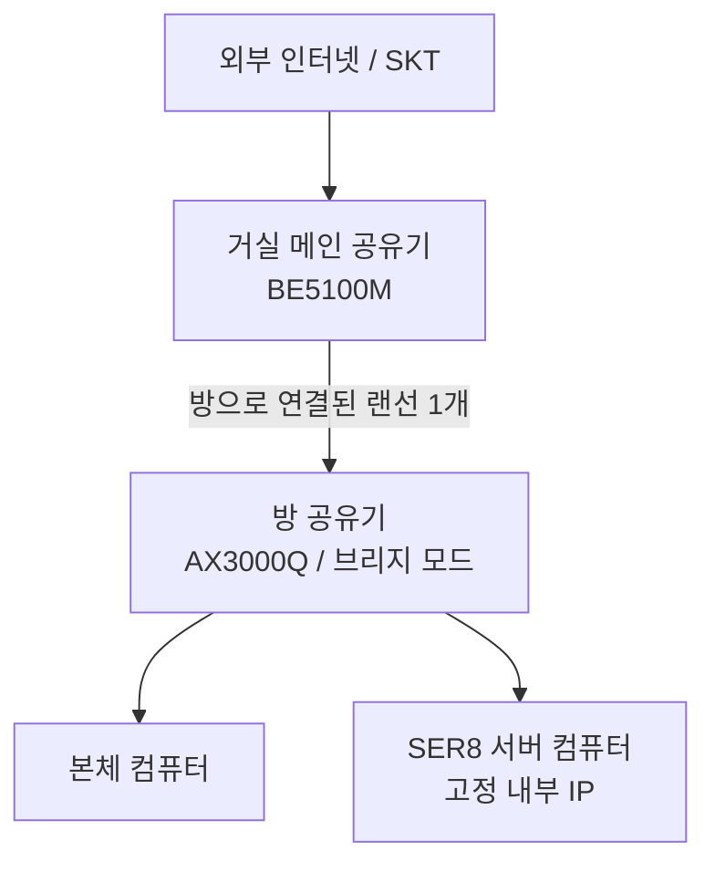
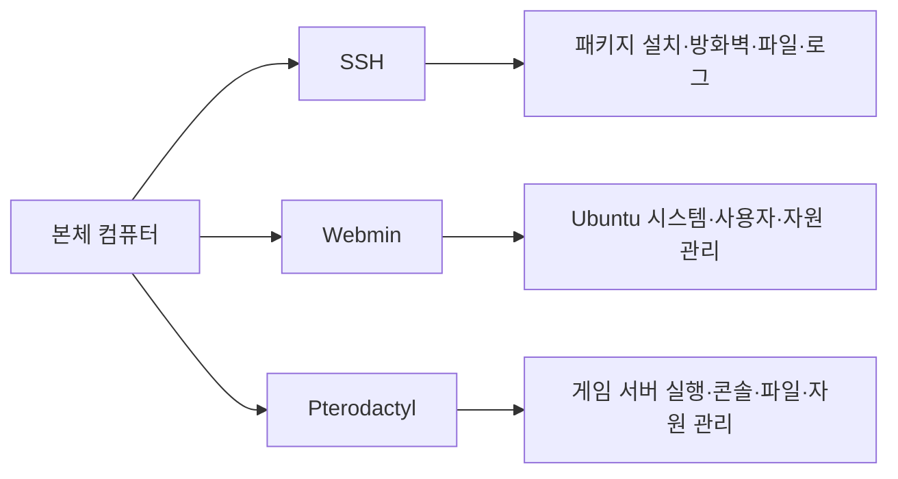
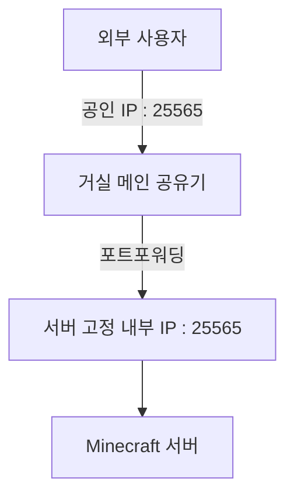

# Ubuntu 기반 홈 게임 서버 인프라 구축

> 개인 PC에서 실행하던 게임 서버를 전용 미니 PC로 분리하고, Ubuntu·Pterodactyl·Webmin·SSH를 이용해 관리할 수 있도록 구축한 홈 서버 프로젝트입니다.

## 프로젝트 요약

| 항목 | 내용 |
|---|---|
| 시작 시기 | 2026년 |
| 프로젝트 유형 | 개인용 및 친구들과 사용하는 홈 게임 서버 |
| 운영 게임 | Minecraft Java Edition, Project Zomboid, Palworld 등 |
| 운영 방식 | 필요할 때 Pterodactyl 패널에서 실행 및 중지 |
| 운영체제 | Ubuntu Desktop 24.04.4 LTS |
| 관리 도구 | SSH, Webmin, Pterodactyl |
| 외부 공개 | 게임 서버 포트만 공개 |
| 관리 페이지 | 내부 네트워크에서만 접근 가능 |

## 1. 구축 배경과 목적

처음에는 개인용 컴퓨터에서 게임 서버를 직접 실행했습니다. 그러나 친구들이 서버를 사용하려면 개인 컴퓨터를 계속 켜 두어야 했고, 본체의 조명과 팬 소음 때문에 장시간 운영이 불편했습니다.

또한 게임 서버가 CPU와 RAM을 사용하면서, 같은 컴퓨터에서 게임을 실행할 때 프레임과 반응성이 저하되는 문제가 있었습니다. 이를 해결하기 위해 게임 플레이용 컴퓨터와 서버 운영 환경을 분리하기로 결정했습니다.

저소음으로 장시간 사용할 수 있는 미니 PC를 조사한 뒤 SER8을 전용 서버로 구매했습니다. 이 프로젝트의 목표는 다음과 같습니다.

- 개인 컴퓨터와 게임 서버의 하드웨어 자원 분리
- 개인 컴퓨터가 꺼져 있어도 친구들이 접속할 수 있는 환경 구축
- 여러 게임 서버를 하나의 패널에서 통합 관리
- Linux, 네트워크, 방화벽, 원격 관리 경험 습득
- 서버 운영 중 발생하는 문제를 직접 분석하고 해결

## 2. 하드웨어 사양

| 구분 | 사양 |
|---|---|
| 제품 | SER8 미니 PC |
| CPU | AMD Ryzen 7 8745HS |
| RAM | Micron 16GB |
| 저장장치 | Samsung SSD 512GB |
| 네트워크 | 유선 Ethernet |
| 구매 형태 | 중고, 번개장터 |
| 구매 가격 | 455,000원 |

확인하지 못한 메인보드, 전원부 등의 세부 모델은 포트폴리오에서 제외했습니다.

## 3. 네트워크 인프라 구성

방에는 거실에서 들어오는 랜선이 한 개만 있었지만, 본체 컴퓨터와 서버 컴퓨터를 모두 유선으로 연결해야 했습니다. 거실에서 랜선을 두 개 새로 끌어오는 것은 구조상 어려웠기 때문에, 방에 별도의 공유기를 설치하고 브리지 모드로 구성했습니다.

### 네트워크 설정

- 통신사: SKT
- 거실 공유기: BE5100M
- 방 공유기: AX3000Q
- 방 공유기 동작 방식: 브리지 모드
- 서버 연결 방식: 유선
- 서버 고정 내부 IP: 설정 완료
- 공인 IP: 사용 중
- Minecraft 포트: `25565`
- Project Zomboid: 기본 서버 포트 사용

초기 공유기 환경에서 마인크래프트 서버를 실행했을 때 인터넷이 버벅이는 현상이 발생했습니다. 공유기 처리 성능을 원인으로 의심하여 거실과 방의 공유기를 모두 업그레이드했습니다. 다만 교체 전후의 패킷 손실, 지연시간, 대역폭을 수치로 측정하지 않아 개선 효과를 정량적으로 입증하지는 못했습니다.

이 경험을 통해 장비 교체 전 네트워크 상태를 먼저 측정하는 과정이 중요하다는 점을 배웠습니다.

## 4. 운영체제 전환 과정

### Windows 10

초기에는 Windows 10과 원격 데스크톱을 이용해 서버를 운영했습니다. 익숙한 GUI 환경이라는 장점이 있었지만, 운영체제와 백그라운드 프로그램이 RAM을 많이 사용하여 게임 서버에 할당할 수 있는 자원이 줄어드는 문제가 있었습니다.

### Ubuntu Desktop

자원 사용을 줄이고 Linux 환경을 학습하기 위해 Ubuntu로 전환했습니다. Linux를 처음 사용하는 상황에서 CLI 전용 환경은 진입 장벽이 높다고 판단하여 GUI가 포함된 Ubuntu Desktop을 선택했습니다.

- 현재 버전: Ubuntu Desktop 24.04.4 LTS
- 설치 언어: 한국어
- 설치 미디어: Rufus로 제작한 USB 부팅 디스크
- Java: 설치 완료

처음에는 Ubuntu 26.04 LTS를 설치했지만 키보드 입력이 밀리는 현상이 발생해 24.04.4 LTS로 변경했습니다.

## 5. 원격 관리 환경

서버 컴퓨터에 모니터와 키보드를 매번 연결하지 않고 관리할 수 있도록 세 가지 도구의 역할을 분리했습니다.

### SSH

다음과 같은 명령어 기반 작업에 사용합니다.

- Ubuntu 패키지 설치 및 업데이트
- Java 및 추가 프로그램 설치
- 파일 이동과 디렉터리 관리
- UFW 방화벽 규칙 설정
- 서비스 상태와 오류 로그 확인

SSH는 비밀번호 인증 방식을 사용하며, 외부 포트포워딩을 하지 않아 가정 내부 네트워크에서만 접근할 수 있습니다.

### Webmin

Ubuntu 시스템 자체를 웹 GUI로 관리하기 위해 사용합니다.

- CPU, RAM, 저장 공간 확인
- 사용자와 권한 관리
- 실행 중인 서비스 확인
- 로그 및 패키지 관리
- 재부팅과 종료

Webmin 역시 내부 IP를 통해서만 접근할 수 있습니다.

### Pterodactyl

게임 서버를 웹에서 통합 관리합니다.

- 서버 실행, 중지, 재시작
- 실시간 콘솔 확인 및 명령어 입력
- 파일 업로드와 수정
- CPU, RAM, 저장 공간 할당
- 네트워크 포트 할당
- 백업 및 복구

Pterodactyl과 관련 서비스는 `systemd`에 등록되어 서버 컴퓨터 재부팅 후 자동 실행됩니다. 개별 게임 서버는 항상 실행하지 않고 필요할 때 패널에서 직접 시작합니다.

## 6. 게임 서버 구축

### Minecraft Java Edition

다음 서버 구동 방식을 직접 구성했습니다.

- Vanilla
- Paper
- Purpur
- Forge
- Fabric

| 항목 | 내용 |
|---|---|
| 에디션 | Java Edition |
| 실행 방식 | Pterodactyl 웹 패널 |
| 최대 RAM 할당 | 약 8GB |
| 최대 동시 접속 테스트 | 7명 |
| 기본 포트 | `25565` |
| 평균 TPS | 미측정 |

### 적용 플러그인

| 플러그인 | 버전 | 역할 |
|---|---:|---|
| ChestSort | 14.2.0 | 상자 및 인벤토리 정렬 |
| DiscordSRV | Build 1.30.5 | Minecraft와 Discord 연동 |
| EssentialsX | 2.22.0-dev+112 | 홈, 워프, 관리 명령어 등 기본 기능 |
| GravesX | 4.9.10.10 | 사망 시 아이템을 무덤에 보관 |
| LuckPerms | Bukkit 5.5.49 | 그룹 및 명령어 권한 관리 |
| PlaceholderAPI | 2.12.2 | 다른 플러그인에 서버·플레이어 정보 제공 |
| TAB | 6.0.2 계열 | 탭 목록과 이름표 표시 구성 |

플러그인 실제 기능은 서버 설정에 따라 달라질 수 있으며, 세부 설정 파일은 추후 별도로 정리할 예정입니다.

### 기타 게임

- Project Zomboid 서버
- Palworld 서버

각 서버는 Pterodactyl에서 별도의 인스턴스로 관리합니다.

## 7. 외부 접속과 도메인

친구들이 외부 네트워크에서 Minecraft 서버에 접속할 수 있도록 공유기 포트포워딩과 UFW 규칙을 설정했습니다.

- Minecraft 서버는 외부 접속 테스트 완료
- SSH, Webmin, Pterodactyl은 외부 접근 불가
- 관리 도구는 가정 내부 IP에서만 접근
- MCVKR에서 발급받은 도메인 사용
- DDNS는 사용하지 않음

DDNS를 사용하지 않기 때문에 공인 IP가 변경되면 도메인 설정을 수동으로 확인하거나 수정해야 합니다.

## 8. 성능과 운영 결과

| 항목 | 결과 |
|---|---|
| Vanilla 서버 RAM 사용량 | 약 2GB |
| 대용량 모드팩 RAM 사용량 | 약 8GB |
| CPU 사용량 | 약 40% 수준 |
| 최대 동시 접속 | 7명 |
| 연속 운영 기간 | 약 한 달 |
| 평균 TPS | 미측정 |
| 주요 지연 상황 | 다수 청크를 동시에 생성·로딩할 때 |

### 전용 서버 도입 후 개선점

- 개인 컴퓨터가 꺼져 있어도 서버 운영 가능
- 개인 컴퓨터로 게임할 때 서버로 인한 성능 저하 감소
- 본체 조명과 팬 소음 문제 해결
- 친구들이 필요할 때 접속할 수 있는 환경 마련
- 여러 게임 서버를 하나의 웹 패널에서 관리

## 9. 보안 설정

- UFW 방화벽 사용
- 게임 서버에 필요한 포트만 외부 허용
- SSH, Webmin, Pterodactyl은 내부 네트워크에서만 접근
- SSH 비밀번호 인증 사용
- root 직접 로그인 제한
- 일반 사용자와 관리자 권한 구분
- 관리 패널별 비밀번호 설정
- 월드와 플러그인 파일 백업
- 패키지 수동 업데이트

현재 Minecraft 화이트리스트는 적용하지 않았습니다.

## 10. 향후 개선 계획

- 자동 백업 스케줄 구축
- CPU, RAM, 온도, 저장 공간, 네트워크 모니터링
- UPS 도입 검토
- SSH 공개키 인증 적용 후 비밀번호 인증 비활성화
- 관리 페이지 접근 제어 강화
- RAM 및 저장 공간 증설 검토
- 청크 사전 생성과 서버 최적화
- Discord 봇 기능 확장
- Pterodactyl API를 활용한 서버 상태 및 실행 자동화
- 공인 IP 변경에 대응하기 위한 DDNS 도입 검토

## 11. 배운 점

이 프로젝트를 통해 단순히 게임 서버 실행 파일을 구동하는 것을 넘어 다음 과정을 직접 경험했습니다.

- 서버용 하드웨어 선정
- Windows와 Linux 운영 환경 비교
- Ubuntu 설치와 시스템 관리
- SSH, Webmin, Pterodactyl 역할 분리
- 공유기 브리지 모드와 유선 네트워크 확장
- 고정 내부 IP, 공인 IP, 포트포워딩 이해
- UFW 방화벽과 접근 범위 설정
- 도메인과 게임 서버 연결
- CPU·RAM 자원 할당과 성능 문제 확인
- 백업, 권한 관리, 서비스 자동 실행

확인되지 않은 내용은 추측해 기록하지 않았고, 측정하지 않은 성능 항목은 미측정으로 명시했습니다.
