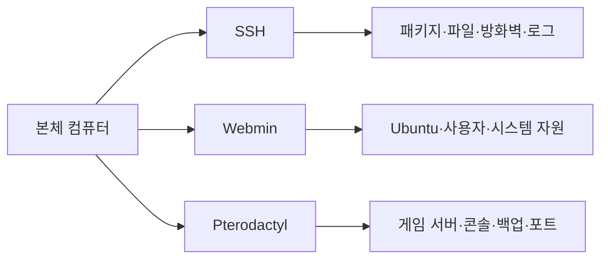

# Ubuntu 기반 홈 게임 서버 인프라 구축

> 개인 PC에서 실행하던 게임 서버를 전용 미니 PC로 분리하고, Ubuntu·Pterodactyl·Webmin·SSH를 이용해 여러 게임 서버를 운영할 수 있도록 구축한 홈 서버 프로젝트입니다.

## 핵심 성과

| 성과 | 결과 |
|---|---|
| 게임 PC와 서버 분리 | 게임 플레이 중 CPU·RAM 자원 경쟁과 소음 문제 감소 |
| 전용 서버 운영 | 개인 PC가 꺼져 있어도 친구들이 접속할 수 있는 환경 구축 |
| 여러 게임 통합 관리 | Minecraft, Project Zomboid, Palworld 서버를 Pterodactyl에서 관리 |
| 실제 운영 검증 | Minecraft 최대 7명 접속, 약 한 달 연속 운영 경험 |
| 성능 확인 | 접속자 1명 기준 TPS 1분·5분·15분 모두 `20.0` |
| 관리 체계 분리 | SSH는 시스템 작업, Webmin은 OS 관리, Pterodactyl은 게임 서버 관리에 사용 |
| 운영 기능 확장 | 도메인·SRV 연결, Discord 알림 연동, Pterodactyl 백업 구성 |

## 프로젝트를 시작한 이유

처음에는 개인용 컴퓨터에서 친구들과 사용할 게임 서버를 직접 실행했습니다. 하지만 서버를 사용하려면 개인 PC를 계속 켜 두어야 했고, 본체의 조명과 팬 소음이 발생했습니다. 게임과 서버가 CPU와 RAM을 함께 사용하면서 게임 성능도 저하됐습니다.

이 문제를 해결하기 위해 저소음 미니 PC인 SER8을 전용 서버로 구매하고, 게임 플레이 환경과 서버 운영 환경을 분리했습니다.

## 내가 설계한 운영 구조

단순히 프로그램을 설치하는 데서 끝내지 않고, 관리 목적에 따라 도구의 역할을 나눴습니다.

- **SSH**: 프로그램 설치, 파일 이동, 방화벽 설정, 로그 확인
- **Webmin**: CPU·RAM·디스크, 사용자, 서비스 등 Ubuntu 시스템 관리
- **Pterodactyl**: 게임 서버 실행·중지, 콘솔, 파일, 자원 할당, 백업 관리

Pterodactyl 관련 서비스는 `systemd`에 등록해 서버 컴퓨터가 재부팅된 뒤 자동 실행되도록 구성했습니다. 개별 게임 서버는 필요할 때 패널에서 실행합니다.

## 직접 판단하고 해결한 문제

| 문제 | 판단과 선택 | 결과 |
|---|---|---|
| 개인 PC에서 서버를 함께 실행하면 성능과 소음 문제가 발생 | SER8 전용 미니 PC를 도입해 환경 분리 | 개인 PC가 꺼져 있어도 서버 운영 가능 |
| 방에 유선 랜선이 한 개뿐임 | 방 공유기를 브리지 모드로 구성 | 본체와 서버를 같은 내부 네트워크에 유선 연결 |
| Windows 10이 서버용 RAM을 많이 점유 | Ubuntu Desktop 24.04.4 LTS로 전환 | Linux 기반 서버 관리 환경 구축 |
| Ubuntu 원격 데스크톱 관리가 번거로움 | SSH·Webmin·Pterodactyl의 역할 분리 | 전체 GUI 접속 없이 필요한 작업 수행 |
| 메인 서버가 기본 포트가 아닌 `25566`을 사용 | A 레코드와 SRV 레코드 구성 | 친구들이 포트 번호 없이 도메인으로 접속 |
| 공유기 성능을 원인으로 의심했지만 측정값이 없었음 | 공유기를 교체했으나 효과를 단정하지 않음 | 장비 교체 전 데이터 측정이 필요하다는 점을 학습 |

자세한 과정은 [문제 발생 및 해결 과정](./troubleshooting.md)에 기록했습니다.

## 기술 구성

| 구분 | 사용 기술 |
|---|---|
| 하드웨어 | SER8, Ryzen 7 8745HS, RAM 16GB, Samsung SSD 512GB |
| 운영체제 | Ubuntu Desktop 24.04.4 LTS |
| 시스템 관리 | SSH, Webmin, systemd, UFW |
| 게임 서버 관리 | Pterodactyl, Wings, Docker |
| Minecraft | Vanilla, Paper, Purpur, Forge, Fabric |
| 네트워크 | 유선 Ethernet, 브리지 모드, 포트포워딩 |
| 외부 접속 | 공인 IP, 도메인 A 레코드, SRV 레코드 |
| 연동·운영 | DiscordSRV, Pterodactyl Backup |

## 운영 결과

- Minecraft 최대 7명 동시 접속 경험
- 약 한 달 연속 운영 경험
- 접속자 1명 기준 TPS `20.0 / 20.0 / 20.0`
- 게임 내 핑 약 `9ms`
- 서버 시작 직후 메모리 약 `892MiB / 8GiB`
- Pterodactyl 백업 3개 생성 확인
- Discord에서 서버 시작·종료, 접속·퇴장, 발전 과제 알림 확인
- 여러 청크를 동시에 생성하거나 불러올 때 일시적인 지연 확인

현재 성능 측정은 접속자 1명 또는 대기 상태가 중심이며, 다중 접속 상황은 추후 같은 조건으로 추가 측정할 예정입니다.

## 현재 상태와 한계

- 서버 인프라와 관리 환경은 구축 완료
- 게임 서버는 항상 실행하지 않고 필요할 때 시작
- DDNS는 사용하지 않아 공인 IP 변경 시 도메인 확인이 필요
- Minecraft 화이트리스트는 현재 미적용
- 공유기 교체 전후 성능은 정량적으로 비교하지 못함
- 다중 접속 TPS와 청크 생성 부하는 추가 측정 필요

측정하지 않은 항목은 추측하지 않고 미측정 또는 향후 확인 항목으로 구분했습니다.

## 상세 문서

- [기술 구성 상세](./technical-details.md) — 하드웨어, 네트워크, 운영체제, 관리 도구, 플러그인
- [문제 발생 및 해결 과정](./troubleshooting.md) — 문제별 판단, 해결, 결과와 배운 점
- [구축 및 운영 증거 자료](./evidence.md) — 성능 측정값과 준비한 화면 자료
- [서버 보안 점검 기록](./security-audit.md) — 서비스 포트와 향후 보안 개선 항목

## 향후 개선 계획

- 다중 접속 및 신규 청크 생성 상황 성능 측정
- 자동 백업 일정과 복구 테스트 정리
- SSH 공개키 인증 적용 검토
- 관리 서비스 접근 범위 정리
- RAM·저장 공간 증설 검토
- Discord 봇 및 Pterodactyl API 기반 관리 자동화

## 배운 점

이 프로젝트를 통해 완성된 호스팅 서비스를 사용하는 대신, 하드웨어 선정부터 운영체제 전환, 네트워크 확장, 원격 관리 구조, 외부 접속, 백업과 성능 확인까지 직접 경험했습니다.

특히 문제가 발생했을 때 단순히 도구를 추가하는 것이 아니라, **문제의 원인을 판단하고 운영 목적에 맞게 구조를 변경하는 과정**이 중요하다는 점을 배웠습니다.
