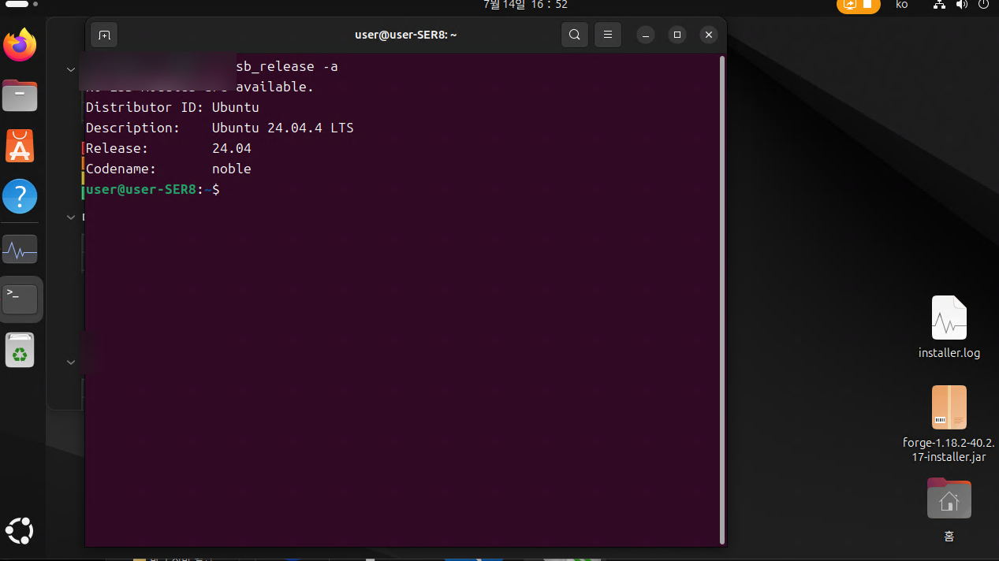
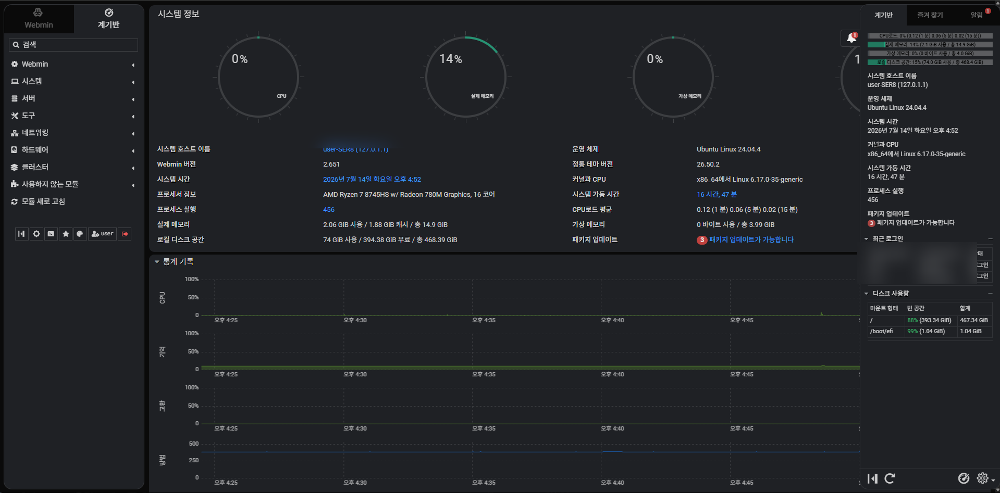
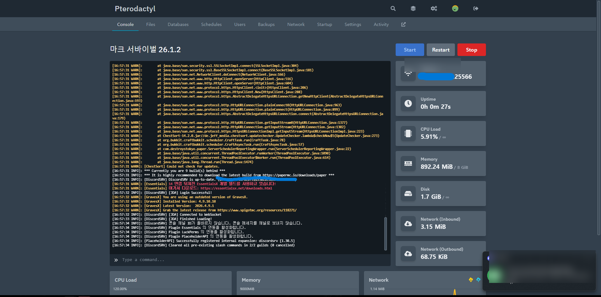
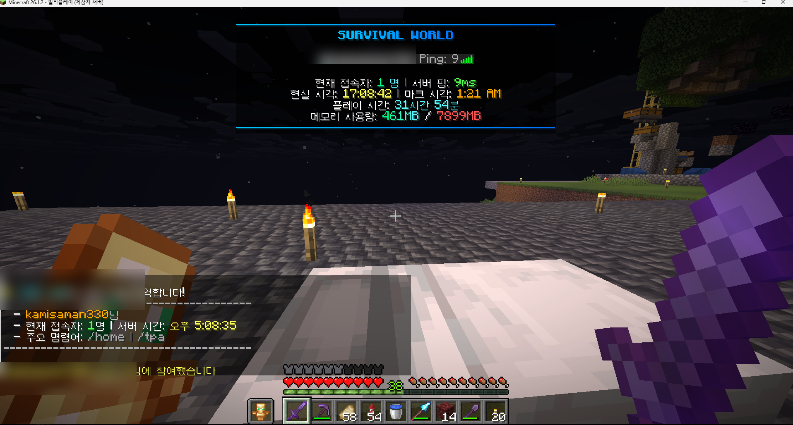
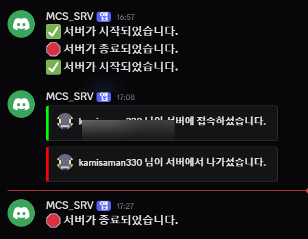
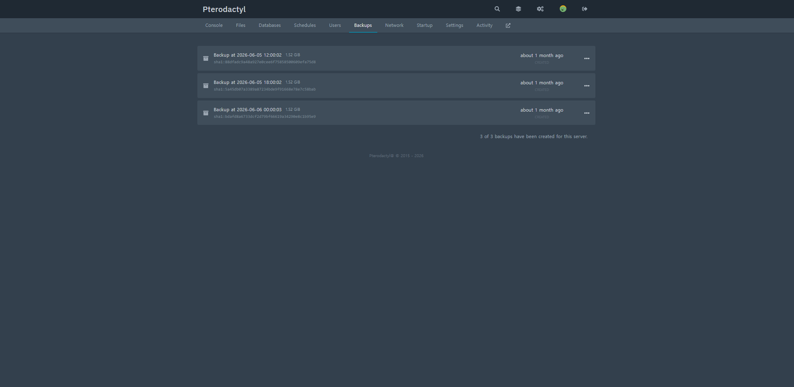
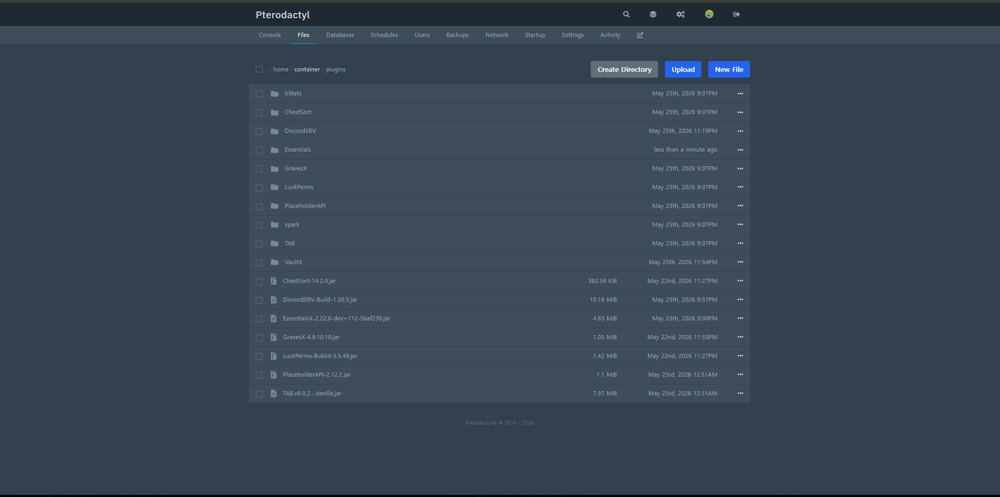
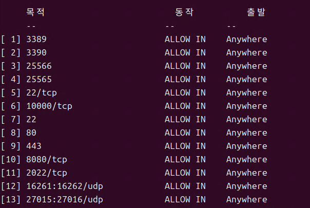
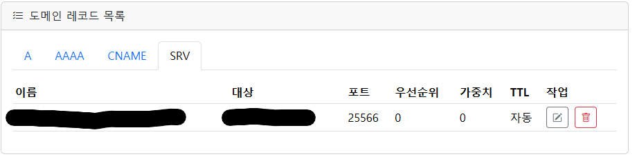

# 구축 및 운영 증거 자료

> 공개용 포트폴리오에는 사용자 이름, 내부·공인 IP, 실제 도메인, Discord 사용자 정보를 가린 이미지만 사용합니다.

## 확인된 운영 결과

| 항목 | 확인 결과 |
|---|---|
| 운영체제 | Ubuntu Desktop 24.04.4 LTS |
| 서버 CPU | AMD Ryzen 7 8745HS |
| 시스템 RAM | 약 16GB |
| 저장장치 | 약 512GB SSD |
| 관리 도구 | SSH, Webmin, Pterodactyl |
| 게임 서버 | Minecraft, Project Zomboid 등 |
| Minecraft 서버 관리 | Pterodactyl 웹 패널 |
| Minecraft 서버 포트 | 기본 서버 25565, 메인 서바이벌 서버 25566 |
| 외부 접속 | 공유기 포트포워딩을 통한 Minecraft 접속 확인 |
| 도메인 | A 레코드와 SRV 레코드를 사용해 25566 포트 연결 |
| 최대 접속 경험 | 최대 7명 |
| 연속 운영 경험 | 약 한 달 |
| 백업 | Pterodactyl 백업 3개 생성 확인 |
| Discord 연동 | 서버 시작·종료, 접속·퇴장, 발전 과제 알림 확인 |

## 측정 결과

### Minecraft 서버 상태

- TPS 1분: `20.0`
- TPS 5분: `20.0`
- TPS 15분: `20.0`
- 측정 당시 접속자: 1명
- 게임 내 핑: 약 `9ms`
- 서버 시작 직후 CPU 사용량: 약 `5.91%`
- 서버 시작 직후 메모리 사용량: 약 `892MiB / 8GiB`
- 일반 대기 상태 CPU 그래프: 약 `3%` 전후

현재 측정은 접속자 1명 또는 대기 상태 기준이다. 3명 이상 일반 플레이와 다수 신규 청크 생성 상황은 추후 별도 측정한다.

## 화면 자료

### 1. Ubuntu 운영체제 확인

Ubuntu Desktop 24.04.4 LTS 설치 상태를 확인한 화면이다.

### 2. 시스템 자원과 게임 서버 관리

| Webmin 시스템 대시보드 | Pterodactyl 서버 목록 |
|---|---|
|  |  |

Webmin에서는 Ubuntu 시스템 자원과 서비스를 확인하고, Pterodactyl에서는 Minecraft와 Project Zomboid 등의 게임 서버를 분리된 인스턴스로 관리한다.

### 3. Minecraft 서버 실행과 실제 접속

| Pterodactyl 콘솔과 자원 사용량 | 실제 Minecraft 서버 플레이 |
|---|---|
|  |  |

Pterodactyl 웹 패널에서 서버 프로세스와 콘솔을 확인하고, 클라이언트에서 실제 서버 접속을 검증했다.

### 4. Discord 연동과 백업

| DiscordSRV 연동 | Pterodactyl 백업 |
|---|---|
|  |  |

DiscordSRV를 통해 서버 시작·종료와 플레이어 접속 정보를 Discord에서 확인했으며, Pterodactyl에서 서버 백업 파일을 생성했다.

### 5. Minecraft 플러그인 구성

ChestSort, DiscordSRV, EssentialsX, GravesX, LuckPerms, PlaceholderAPI, TAB 등을 적용해 편의 기능, 권한 관리, Discord 연동과 UI 표시 기능을 구성했다.

### 6. 방화벽과 도메인 설정

| UFW 방화벽 규칙 | 도메인 A·SRV 레코드 |
|---|---|
|  |  |

Ubuntu UFW에서 서버 운영에 필요한 포트를 관리했고, A 레코드와 SRV 레코드를 이용해 기본 포트가 아닌 `25566` 서버에 도메인만으로 접속할 수 있도록 구성했다.

## 공개 전 제거한 정보

- Ubuntu 사용자 이름과 호스트 이름
- 내부 IP와 공인 IP
- 실제 도메인
- Pterodactyl 서버 식별 주소
- Discord 사용자 이름과 서버 멤버 정보
- MAC 주소, 토큰, 비밀번호, API 키