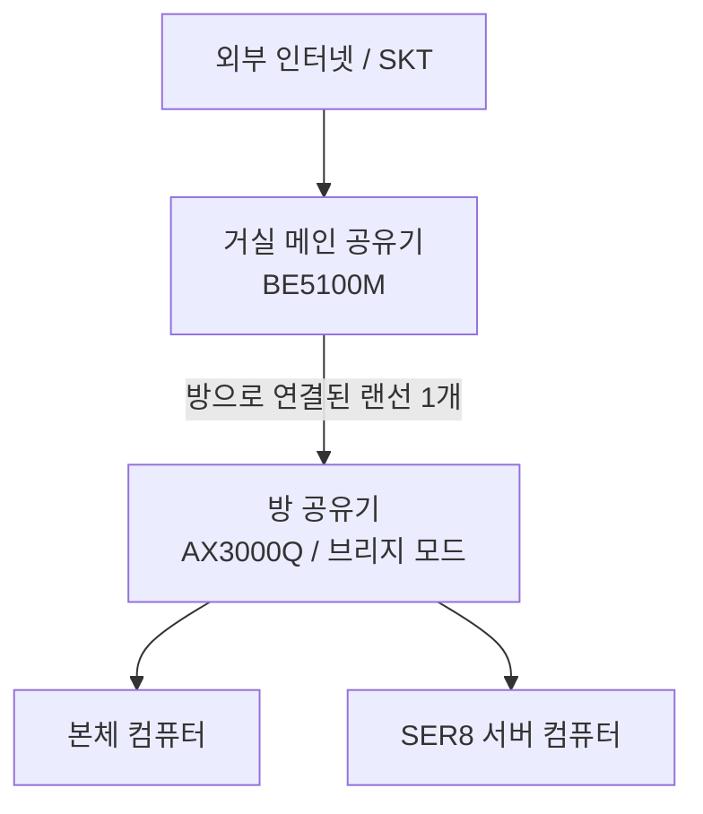
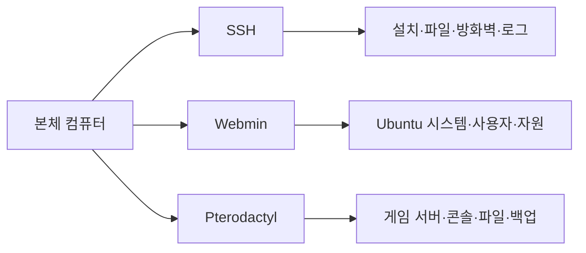
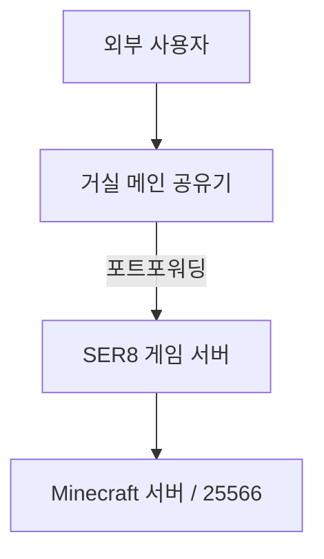

# 기술 구성 상세

> 메인 README에서는 프로젝트의 문제 해결 과정과 핵심 성과를 요약하고, 이 문서에서는 하드웨어·네트워크·운영체제·관리 도구·게임 서버 구성을 상세히 기록합니다.

## 1. 하드웨어

| 구분 | 사양 |
|---|---|
| 제품 | SER8 미니 PC |
| CPU | AMD Ryzen 7 8745HS |
| RAM | Micron 16GB |
| 저장장치 | Samsung SSD 512GB |
| 네트워크 | 유선 Ethernet |
| 구매 형태 | 번개장터 중고 구매 |
| 구매 가격 | 455,000원 |

확인하지 못한 메인보드와 전원부 등의 세부 모델은 추측해 기록하지 않았습니다.

## 2. 네트워크 구성

방에는 거실에서 들어오는 랜선이 한 개뿐이었지만, 본체 컴퓨터와 서버 컴퓨터를 모두 유선으로 연결해야 했습니다. 거실에서 랜선을 추가로 설치하는 대신 방에 공유기를 배치하고 브리지 모드로 구성했습니다.

### 네트워크 정보

- 통신사: SKT
- 거실 공유기: BE5100M
- 방 공유기: AX3000Q
- 방 공유기 동작 방식: 브리지 모드
- 서버 연결 방식: 유선
- 내부 네트워크: `192.168.0.0/24`
- Minecraft 서버 포트: `25565`, `25566`
- 메인 서바이벌 서버: `25566`
- Project Zomboid: 기본 서버 포트 사용

Ubuntu에서는 현재 내부 주소가 DHCP 방식으로 표시됩니다. 공유기의 DHCP 예약 여부는 별도로 확인할 항목으로 남겨 두었습니다.

초기 공유기 환경에서 인터넷이 버벅이는 현상이 발생해 거실과 방의 공유기를 업그레이드했습니다. 다만 교체 전후 패킷 손실과 지연시간을 측정하지 않아 개선 효과를 수치로 입증하지는 못했습니다. 이를 통해 장비 교체 전 측정 데이터를 먼저 확보해야 한다는 점을 배웠습니다.

## 3. 운영체제 전환

### Windows 10

초기에는 Windows 10과 원격 데스크톱을 사용했습니다. 익숙한 GUI라는 장점은 있었지만, 운영체제와 백그라운드 프로그램이 RAM을 사용해 게임 서버에 할당할 수 있는 자원이 줄어들었습니다.

### Ubuntu Desktop 24.04.4 LTS

자원 사용을 줄이고 Linux 환경을 학습하기 위해 Ubuntu로 전환했습니다. Linux를 처음 사용하는 상황이었기 때문에 CLI 전용 Ubuntu Server 대신 GUI가 포함된 Desktop 버전을 선택했습니다.

- 현재 버전: Ubuntu Desktop 24.04.4 LTS
- 설치 언어: 한국어
- 설치 미디어: Rufus로 제작한 USB 부팅 디스크
- Java: 설치 완료

처음에는 Ubuntu 26.04 환경을 설치했지만 키보드 입력이 밀리는 현상이 발생해 24.04.4 LTS로 변경했습니다.

## 4. 원격 관리 구조

서버 컴퓨터에 직접 모니터와 키보드를 연결하지 않고 관리할 수 있도록 도구별 역할을 분리했습니다.

### SSH

- Ubuntu 패키지 및 프로그램 설치
- Java와 추가 서비스 설치
- 파일 이동과 디렉터리 관리
- UFW 방화벽 규칙 설정
- 서비스 상태와 오류 로그 확인

현재 비밀번호 인증 방식을 사용하며, 공유기에서 외부 포트포워딩하지 않아 가정 내부 네트워크에서만 접속합니다.

### Webmin

- CPU, RAM, 저장 공간 확인
- 사용자와 권한 관리
- 실행 중인 서비스 확인
- 시스템 로그와 패키지 관리
- 재부팅과 종료

### Pterodactyl

- 게임 서버 실행·중지·재시작
- 실시간 콘솔과 명령어 입력
- 파일 업로드와 수정
- CPU·RAM·저장 공간 할당
- 네트워크 포트 할당
- 백업 생성과 복구 관리

Pterodactyl 관련 서비스는 `systemd`에 등록되어 서버 컴퓨터 재부팅 후 자동 실행됩니다. 개별 게임 서버는 필요할 때 패널에서 시작합니다.

## 5. 게임 서버 구성

### Minecraft Java Edition

직접 구성한 서버 구동 방식은 다음과 같습니다.

- Vanilla
- Paper
- Purpur
- Forge
- Fabric

| 항목 | 내용 |
|---|---|
| 실행 방식 | Pterodactyl 웹 패널 |
| 최대 RAM 할당 | 약 8GB |
| 최대 동시 접속 경험 | 7명 |
| 메인 서바이벌 포트 | `25566` |
| 측정 당시 TPS | 1분·5분·15분 모두 `20.0` |

### 적용 플러그인

| 플러그인 | 버전 | 역할 |
|---|---:|---|
| ChestSort | 14.2.0 | 상자 및 인벤토리 정렬 |
| DiscordSRV | Build 1.30.5 | Minecraft와 Discord 연동 |
| EssentialsX | 2.22.0-dev+112 | 홈, 워프, 관리 명령어 |
| GravesX | 4.9.10.10 | 사망 아이템을 무덤에 보관 |
| LuckPerms | Bukkit 5.5.49 | 그룹과 명령어 권한 관리 |
| PlaceholderAPI | 2.12.2 | 서버·플레이어 정보 연동 |
| TAB | 6.0.2 계열 | 탭 목록과 이름표 구성 |

### 기타 게임

- Project Zomboid
- Palworld

각 게임은 Pterodactyl에서 별도의 서버 인스턴스로 관리합니다.

## 6. 외부 접속과 도메인

친구들이 Minecraft 서버에 접속할 수 있도록 공유기 포트포워딩과 UFW 규칙을 구성했습니다.

- MCVKR에서 발급받은 도메인 사용
- A 레코드를 공인 IP에 연결
- SRV 레코드를 `25566` 포트에 연결
- 사용자는 포트 번호 없이 도메인으로 접속 가능
- DDNS는 사용하지 않음
- SSH, Webmin, Pterodactyl은 외부 포트포워딩하지 않음

DDNS를 사용하지 않기 때문에 공인 IP가 변경되면 도메인 설정을 수동으로 확인해야 합니다.

## 7. 운영 및 성능 기록

| 항목 | 결과 |
|---|---|
| 최대 동시 접속 경험 | 7명 |
| 연속 운영 경험 | 약 한 달 |
| Vanilla RAM 사용량 | 약 2GB |
| 대용량 모드팩 RAM 사용량 | 약 8GB |
| 과거 확인 CPU 사용량 | 약 40% 수준 |
| TPS 측정 | 접속자 1명 기준 20.0 / 20.0 / 20.0 |
| 게임 내 핑 | 약 9ms |
| 서버 시작 직후 메모리 | 약 892MiB / 8GiB |
| 주요 지연 상황 | 여러 청크를 동시에 생성·로딩할 때 |

현재 정량 측정은 접속자 1명 또는 대기 상태가 중심입니다. 다중 접속과 신규 청크 생성 상황은 추후 같은 조건으로 다시 측정할 예정입니다.

## 8. 보안과 백업

- UFW 방화벽 사용
- 게임 서버 포트만 공유기에서 외부 포트포워딩
- 관리 도구는 가정 내부 네트워크에서 사용
- root 계정 직접 로그인 제한
- 일반 사용자와 관리자 권한 구분
- MariaDB와 Redis는 localhost에 바인딩
- Pterodactyl 백업 3개 생성 확인

현재 포트와 개선 항목은 [서버 보안 점검 기록](./security-audit.md)에 별도로 정리했습니다.

## 관련 문서

- [프로젝트 메인 소개](./README.md)
- [문제 발생 및 해결 과정](./troubleshooting.md)
- [구축 및 운영 증거 자료](./evidence.md)
- [서버 보안 점검 기록](./security-audit.md)
