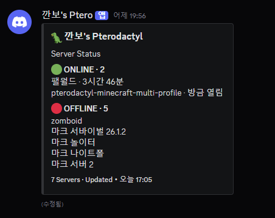
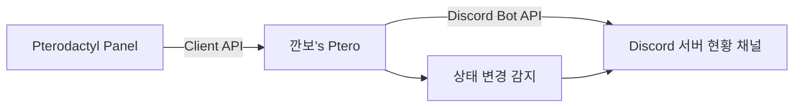

# 깐보's Ptero

> Pterodactyl에서 운영 중인 게임 서버의 현재 상태를 Discord 접속자에게 간단하게 보여주기 위해 만든 상태 현황판 봇입니다.



## 프로젝트 결과

`깐보's Ptero`는 관리자가 서버를 제어하기 위한 도구보다, **Discord에 들어온 사용자가 어떤 게임 서버가 현재 열려 있는지 바로 확인할 수 있는 현황판**을 목표로 제작했습니다.

현재 동작하는 기능은 다음과 같습니다.

| 기능 | 결과 |
|---|---|
| 서버 목록 자동 조회 | Pterodactyl Client API에서 접근 가능한 서버를 자동으로 가져옴 |
| 서버 상태 표시 | `ONLINE`, `STARTING`, `STOPPING`, `OFFLINE` 상태를 Discord Embed로 표시 |
| 업타임 표시 | 실행 중인 서버에만 `방금 열림`, `22시간 26분`, `1일 3시간` 형태로 표시 |
| 상태 변경 알림 | 서버가 열리거나 종료되면 짧은 Discord 메시지 전송 |
| 자동 갱신 | 상태는 주기적으로 확인하고, 변화가 있거나 업타임 갱신 시간이 되었을 때 현황판 수정 |
| 서버 추가·삭제 자동 반영 | 별도의 게임 목록 파일이나 수동 서버 등록 없이 자동 반영 |
| 민감정보 분리 | Discord Token과 Pterodactyl API Key는 `.env`에만 저장하고 Git에서 제외 |

## 최종 디자인

정보를 많이 넣는 관리 패널보다, 접속자가 한눈에 이해할 수 있도록 표시 항목을 최소화했습니다.

```text
🦖 깐보's Pterodactyl

Server Status

🟢 ONLINE · 1
팰월드 · 22시간 26분

🔴 OFFLINE · 5
zomboid
마크 서버이벌 26.1.2
마크 놀이터
마크 나이트폴
마크 서버 2

6 Servers · Updated
```

CPU, RAM, 디스크, 콘솔, Start/Stop/Restart 버튼, 게임 종류 같은 관리용 정보는 의도적으로 제외했습니다.

## 프로젝트를 시작한 이유

Pterodactyl에서 여러 게임 서버를 운영하고 있지만, 실제 접속자는 Pterodactyl 패널을 확인하지 않습니다. 결국 서버가 열려 있는지 확인하려면 관리자에게 묻거나 게임에서 직접 접속을 시도해야 했습니다.

처음에는 Discord에서 Pterodactyl을 제어하는 관리 봇도 검토했지만, 실제 필요는 **"지금 어떤 서버가 열려 있는가"를 보여주는 것**에 더 가까웠습니다. 그래서 기능을 늘리기보다 상태 표시와 알림에 집중했습니다.

## 구성



봇 자체도 Pterodactyl의 Node.js Egg에서 하나의 서버로 실행합니다.

```text
SER8 / Pterodactyl
├─ 게임 서버들
│  ├─ Palworld
│  ├─ Minecraft
│  └─ Project Zomboid
└─ 깐보's Ptero
   └─ Node.js + discord.js
```

## 기술 구성

| 구분 | 기술 |
|---|---|
| Runtime | Node.js 20+ |
| Discord | discord.js 14 |
| 설정 관리 | dotenv |
| 서버 상태 조회 | Pterodactyl Client API |
| 배포 | Pterodactyl Generic Node.js Egg |
| 실행 환경 | Ubuntu 기반 홈 서버 / Docker / Wings |

## 주요 설계 판단

### 1. Application API가 아닌 Client API 사용

서버 생성이나 사용자·노드 관리 권한이 필요한 프로젝트가 아니므로 관리자용 Application API 대신 Client API Key(`ptlc_...`)를 사용했습니다. 필요한 권한 범위를 서버 상태 조회에 맞게 줄였습니다.

### 2. 게임 종류 자동 추론 제거

초기 버전에서는 Egg 이름과 서버 이름을 이용해 Minecraft, Palworld 등을 추론하고 `games.json`으로 예외를 직접 등록했습니다. 하지만 서버를 추가할 때마다 별도 설정을 수정해야 하는 구조가 자동화 목적과 맞지 않았습니다.

최종 버전에서는 게임 종류 표시 자체를 제거하고 Pterodactyl의 서버 이름과 상태만 사용합니다. 이 변경으로 새로운 서버를 만들어도 봇 설정을 수정할 필요가 없어졌습니다.

### 3. 관리 기능보다 접속자용 정보에 집중

Start, Stop, Restart 버튼이나 CPU/RAM 표시도 검토했지만 최종적으로 제외했습니다. 이 봇의 사용자는 서버 관리자가 아니라 Discord의 게임 서버 접속자라는 기준을 세웠기 때문입니다.

### 4. 불필요한 Discord 수정 최소화

Pterodactyl 상태는 짧은 간격으로 확인하되, Discord Embed는 상태가 변경되었거나 업타임 표시를 갱신할 시점에만 수정합니다. 상태 확인 주기와 화면 갱신 주기를 분리했습니다.

## 문제 해결 과정

개발 과정에서 실제 운영 환경에서 발생한 문제들을 하나씩 해결했습니다.

| 문제 | 원인 | 해결 |
|---|---|---|
| `ECONNREFUSED 127.0.0.1:80` | Pterodactyl 컨테이너 내부의 `127.0.0.1`은 호스트가 아니라 해당 컨테이너 자신 | Panel URL을 내부망의 실제 서버 IP로 변경 |
| API 호출 실패 | Application API Key와 Client API Key의 역할 혼동 | Client API용 `ptlc_...` 키 사용 |
| Discord `50013 Missing Permissions` | 상태 채널에서 Embed 메시지를 보낼 권한 부족 | 채널별 `채널 보기`, `메시지 보내기`, `링크 첨부`, `메시지 기록 보기` 권한 설정 |
| 게임 이름 `Unknown` | Client API만으로 모든 커스텀 서버 이름을 안정적으로 게임에 매핑하기 어려움 | 게임 종류 표시 제거, 서버 이름 중심 설계로 변경 |
| 화면이 관리 패널처럼 복잡함 | 서버별 상태·게임 종류를 3열 Field에 반복 표시 | 상태별 그룹형 세로 목록으로 단순화 |
| 매번 Discord 메시지 수정 | 상태 확인과 화면 갱신을 같은 주기로 처리 | 상태 변경 시 즉시 갱신 + 업타임은 별도 주기로 갱신 |

더 자세한 버전별 변화는 [개발 과정 기록](./development-log.md)에 정리했습니다.

## 저장소 구조

```text
kkanbo-ptero/
├─ README.md
├─ development-log.md
├─ images/
│  └─ server-status.png
├─ release/
│  └─ kkanbo-ptero-v3.1.zip
└─ source/
   ├─ src/
   │  ├─ index.js
   │  ├─ pterodactyl.js
   │  └─ statusBoard.js
   ├─ .env.example
   ├─ .gitignore
   ├─ package.json
   ├─ install.sh
   ├─ start.sh
   ├─ install.bat
   └─ start.bat
```

## 실행 설정

실제 Token/API Key는 저장소에 포함하지 않습니다. `source/.env.example`을 복사한 뒤 개인 환경에서 `.env`를 만들어 사용합니다.

```env
DISCORD_TOKEN=
DISCORD_CHANNEL_ID=
DISCORD_NOTIFICATION_CHANNEL_ID=
PTERODACTYL_URL=https://panel.example.com
PTERODACTYL_API_KEY=
UPDATE_INTERVAL_SECONDS=30
BOARD_REFRESH_SECONDS=300
PANEL_NAME=깐보's Pterodactyl
EXCLUDE_SERVERS=깐보's Ptero
```

## 현재 상태

- Discord 상태 현황판 정상 운영 확인
- 서버 목록 및 ONLINE/OFFLINE 상태 자동 반영 확인
- 실행 중 서버 업타임 표시 확인
- 서버 시작·종료 알림 확인
- Pterodactyl 내부 Node.js 서버로 상시 실행
- V3.1을 현재 완료 버전으로 보관

## 배운 점

기능을 많이 만드는 것보다 **실제 사용자가 누구인지 먼저 정하는 것이 제품의 구조와 UI를 크게 바꾼다**는 점을 경험했습니다.

처음에는 Pterodactyl 관리 기능을 Discord에 옮기는 방향으로 생각했지만, 실제 사용 목적을 다시 정의한 뒤 관리 기능을 제거하고 서버 상태, 업타임, 시작·종료 알림만 남겼습니다. 또한 Docker 컨테이너 네트워크, API 권한 범위, Discord 채널 권한 등 로컬 테스트만으로는 드러나지 않는 운영 환경 문제를 직접 해결했습니다.
