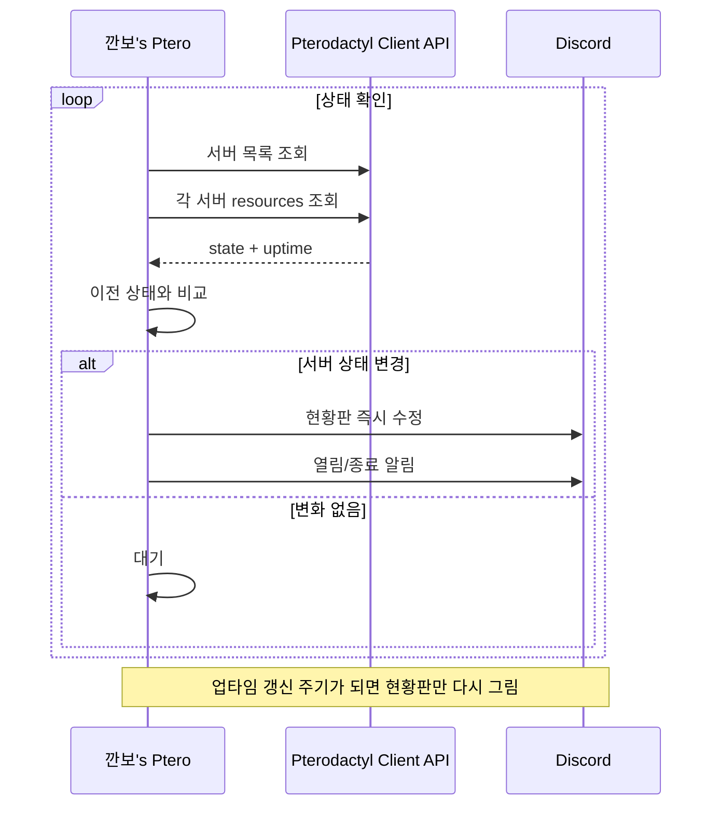

# 깐보's Ptero 개발 과정 기록

이 문서는 완성된 기능만이 아니라, 요구사항을 정리하고 운영 환경에서 문제를 해결하면서 V3.1까지 변화한 과정을 기록합니다.

## 1. 출발점

Pterodactyl에서 여러 게임 서버를 관리하고 있었고, Discord를 사용하는 접속자들이 현재 어떤 서버가 열려 있는지 쉽게 확인할 수 있으면 좋겠다는 요구에서 시작했습니다.

초기 아이디어는 Discord에서 Pterodactyl을 제어하는 관리 봇이었습니다. Start/Stop/Restart, CPU/RAM, 콘솔 같은 기능도 후보에 있었습니다.

하지만 실제 사용 장면을 정리하면서 목표를 다음처럼 바꿨습니다.

> 관리자가 Discord에서 서버를 조작하는 도구가 아니라, 접속자가 보고 "이 서버가 지금 열려 있구나"를 바로 알 수 있는 현황판.

이 결정이 이후 기능과 UI를 단순화하는 기준이 되었습니다.

## 2. 실행 방식 검토

Discord 상태 갱신 기능은 어딘가에서 계속 실행되어야 했기 때문에 다음 방식을 비교했습니다.

- Linux 호스트에서 Node.js 프로세스로 직접 실행
- Discord Webhook + 주기 스크립트
- 외부 호스팅
- Pterodactyl 내부에 Node.js 서버를 만들어 실행

이미 Pterodactyl을 운영 중이고 재시작·로그·파일 관리가 편하다는 점 때문에 **Pterodactyl Generic Node.js Egg 안에서 봇 자체를 실행하는 방식**을 선택했습니다.

리소스는 256MB RAM, 낮은 CPU 제한으로도 충분한 가벼운 구조를 목표로 했습니다.

## 3. V1 — 기본 상태 현황판

첫 번째 버전에서는 다음 기능부터 구현했습니다.

- Discord 봇 로그인
- Pterodactyl 서버 목록 조회
- 각 서버 `/resources` 상태 조회
- Discord Embed 한 개를 생성하고 주기적으로 수정
- 서버 이름, 상태, 게임 종류 표시

초기 화면은 서버마다 다음 정보를 반복하는 카드형 구조였습니다.

```text
🟢 Palworld
상태 ONLINE
게임 Palworld
```

기능은 동작했지만 서버가 늘어날수록 화면이 3열로 빽빽해졌고, `Unknown` 게임 표시도 자주 나타났습니다.

## 4. 실제 배포 문제 해결

### 4.1 Docker 안에서 `127.0.0.1` 사용

Pterodactyl에 봇을 올린 뒤 다음 오류가 발생했습니다.

```text
Error: connect ECONNREFUSED 127.0.0.1:80
```

처음에는 Panel과 봇이 같은 물리 서버에 있기 때문에 `127.0.0.1`을 사용할 수 있다고 생각했습니다. 하지만 Pterodactyl의 게임/앱 서버는 Docker 컨테이너 안에서 실행되므로 컨테이너 안의 `127.0.0.1`은 Ubuntu 호스트가 아니라 **봇 컨테이너 자신**을 의미했습니다.

해결 방법은 Panel URL에 SER8의 내부 네트워크 IP를 사용하는 것이었습니다.

```env
PTERODACTYL_URL=http://192.168.x.x
```

이 과정에서 호스트 네트워크와 컨테이너 네트워크의 차이를 실제 장애를 통해 확인했습니다.

### 4.2 Application API와 Client API

Pterodactyl Admin 화면에는 Application API Key가 있어 처음에는 해당 키를 사용할 수 있다고 생각했습니다.

하지만 봇이 호출하는 경로는 `/api/client/...`였고, 필요한 것은 일반 계정의 **Client API Key(`ptlc_...`)**였습니다.

Application API는 패널 관리 기능에 가깝고, 이번 프로젝트는 자신이 접근 가능한 서버의 상태를 읽는 것이 목적이므로 Client API가 더 적합했습니다.

### 4.3 Discord Missing Permissions

Discord 로그인과 Pterodactyl 조회까지 성공했지만 다음 오류가 발생했습니다.

```text
DiscordAPIError[50013]: Missing Permissions
```

원인은 봇 역할 자체가 아니라 상태 메시지를 보낼 특정 채널의 권한이었습니다.

최종적으로 상태 채널에 다음 권한을 허용했습니다.

- 채널 보기
- 메시지 보내기
- 링크 첨부
- 메시지 기록 보기

이후 Embed 생성과 기존 메시지 수정이 정상 동작했습니다.

## 5. V2 — 수동 게임 등록 제거

초기에는 게임 종류를 보여주기 위해 다음 순서로 판별했습니다.

1. Egg 이름 분석
2. 서버 이름/설명에서 키워드 분석
3. `games.json`에서 수동 예외 등록

예를 들어 서버 이름이 `마크 놀이터`라면 `games.json`에 직접 Minecraft라고 추가해야 했습니다.

```json
{
  "마크 놀이터": "Minecraft"
}
```

이 방식은 새로운 서버가 생길 때마다 봇 설정 파일을 수정해야 했습니다. 자동 상태 현황판이라는 목표와 맞지 않는다고 판단했습니다.

그래서 V2에서는 **게임 종류 자체를 UI에서 제거**했습니다.

서버 접속자에게는 `마크 놀이터`라는 서버 이름만으로 이미 무엇인지 충분히 알 수 있었고, 실제로 필요한 정보는 ONLINE/OFFLINE 상태였습니다.

결과적으로 다음 항목이 사라졌습니다.

- `games.json`
- 게임 이름 추론 코드
- `Unknown` 표시
- 신규 서버 추가 시 수동 설정

## 6. V3 — 접속자용 현황판으로 방향 확정

V3에서는 관리 도구가 아니라 서버 접속자를 위한 상태판이라는 성격을 명확히 했습니다.

추가한 기능은 두 가지였습니다.

### 6.1 업타임

Pterodactyl `/resources` 응답의 uptime 값을 이용해 실행 중인 서버에만 표시했습니다.

```text
팰월드 · 방금 열림
팰월드 · 8분
팰월드 · 1시간 24분
팰월드 · 1일 6시간
```

OFFLINE 서버에는 불필요한 `-` 또는 0초 정보를 표시하지 않았습니다.

### 6.2 상태 변경 알림

상태 전환을 감지해 관리 로그 형식이 아닌 접속자 친화적인 문장으로 표시했습니다.

```text
🟢 팰월드 서버가 열렸습니다.
🔴 팰월드 서버가 종료되었습니다.
```

봇 재시작 직후 기존 서버 상태를 전부 알림으로 보내지 않도록 이전 상태가 없는 서버는 알림에서 제외했습니다.

## 7. Smart Update

처음에는 상태 확인 주기마다 Discord Embed도 항상 수정했습니다.

```text
30초마다 API 확인
→ 매번 Discord 메시지 수정
```

하지만 상태가 동일하다면 Discord 쪽 메시지를 수정할 이유가 없었습니다.

최종 구조는 다음과 같습니다.

```text
30초마다 Pterodactyl 상태 확인
        │
        ├─ 상태 변화 있음 → 즉시 현황판 수정 + 필요한 알림
        │
        └─ 상태 변화 없음 → Discord 수정 안 함
                              │
                              └─ 업타임 갱신 시간이 되면 현황판 수정
```

업타임은 시간이 흐르면서 바뀌므로 Discord 갱신을 완전히 상태 변경 때만 할 수는 없었습니다. 그래서 상태 조회 주기와 화면 업타임 갱신 주기를 분리했습니다.

기본값은 다음과 같습니다.

```env
UPDATE_INTERVAL_SECONDS=30
BOARD_REFRESH_SECONDS=300
```

## 8. V3.1 — 디자인 단순화

실제 Discord 화면을 보면서 마지막으로 UI를 정리했습니다.

초기 디자인:

```text
🟢 팰월드
상태 ONLINE
게임 Palworld

🔴 마크 놀이터
상태 OFFLINE
게임 Unknown
```

최종 디자인:

```text
🦖 깐보's Pterodactyl

Server Status

🟢 ONLINE · 1
팰월드 · 22시간 26분

🔴 OFFLINE · 5
zomboid
마크 서버이벌 26.1.2
마크 놀이터
마크 나이트폴
마크 서버 2

6 Servers · Updated
```

최종 단계에서 제거한 것:

- Discord Embed 브랜드 컬러 강조
- 게임 종류
- CPU/RAM/Disk
- 서버 IP
- 관리자용 버튼
- `/서버` 명령어
- 콘솔 기능
- 상태 확인 주기 같은 내부 운영 정보

남긴 것:

- 서버 이름
- 현재 상태
- ONLINE 서버 업타임
- 서버 열림/종료 알림
- 전체 서버 수와 갱신 시간

## 9. 최종 데이터 흐름



## 10. 최종 판단

이 프로젝트에서 가장 큰 변화는 기능 추가가 아니라 기능 제거였습니다.

처음에는 Pterodactyl의 기능을 Discord에 많이 옮길수록 좋은 봇이라고 생각했지만, 실제 사용자는 서버 관리자보다 게임에 접속하려는 Discord 멤버였습니다.

결과적으로 **사용자의 목적과 직접 관련 없는 기능을 제거하면서 UI와 코드 모두 단순해졌고, 신규 서버가 생겨도 별도 설정 없이 자동으로 반영되는 구조**가 되었습니다.
